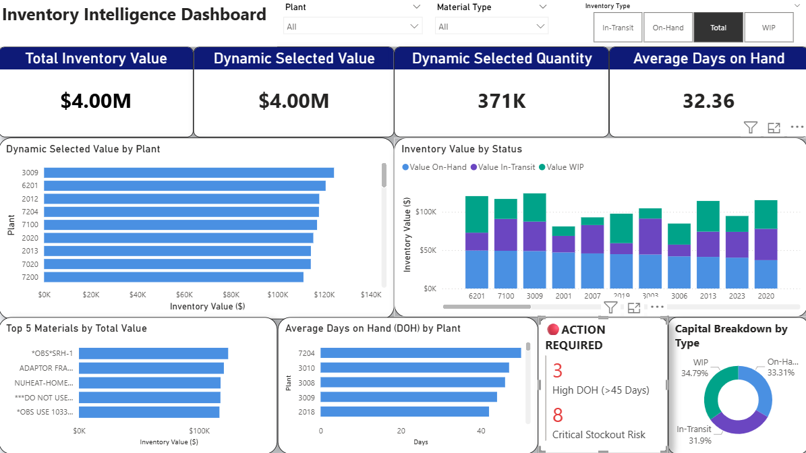

# 📦 Inventory Intelligence Dashboard

## 🚀 Overview
A Power BI dashboard built to provide clear visibility into inventory performance across plants and materials. The dashboard focuses on stock position, WIP, in-transit inventory, and Days on Hand (DOH) to support better operational decision-making.

## 🎯 Objective
This dashboard was designed to:
- Track total inventory quantity and value
- Monitor stock, WIP, and in-transit inventory
- Compare inventory across plants and materials
- Highlight inventory risk using DOH and exception-based views

## 📊 Key Features
- Executive KPI summary
- Inventory composition analysis
- Plant-level inventory comparison
- Material-level monitoring
- DOH tracking
- Exception and risk visibility

## 🛠 Tools & Technologies
- Power BI
- Power Query
- DAX
- Excel
- Data Modelling

## 📷 Dashboard Preview

## 📌 Core KPIs
- Total Inventory Value
- Total Inventory Quantity
- On-Hand Inventory
- WIP Inventory
- In-Transit Inventory
- Average DOH

## 🧩 Data Model
The dashboard follows a fact-and-dimension structure for cleaner reporting and better usability:
- FactInventory
- DimPlant
- DimMaterial

## 💡 Business Value
This dashboard helps improve:
- inventory visibility
- stock monitoring
- exception tracking
- management reporting
- decision-making

## 📁 Repository Structure
- `screenshots/` → Dashboard images
- `docs/` → DAX, assumptions, and insights
- `pbix/` → Power BI file (if shared)

## ⚠️ Note
This is a portfolio version of the project. Any confidential or identifying business information has been excluded.

## 👤 Author
Atharva Patil
